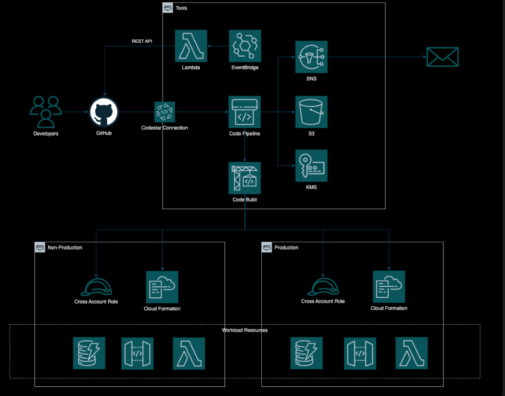

# CDK Code Pipeline Demo

This is a demo for how to use AWS Code Pipeline for creating cross account Continuous Integration and Continuous Delivery pipelines.

There are three stacks:

- A common resources stack, which contains essential resources for pipelines: S3 bucket, KMS key and IAM roles.
- A Continuous Integration pipeline, which builds and deploys PRs to a non-production environment.
- A Continuous Delivery pipeline, which builds and deploys a workload to non-production and production environments.

A separate CloudFormation template for Cross Account roles is used to deploy roles to the target accounts.

## Architecture



### Cross Accounts Roles


## Workload requirements

The pipelines have assumed that there is a separate GitHub repository with a buildspec file, which builds the app and packages templates for deployment. For the purposes
of testing this approach, this was a simple Python application with basic commands to build, test and lint source code and for the packaging of CloudFormation templates.

The example buildspec.yaml is as follows:

```bash
version: 0.2
phases:
  install:
    runtime-versions:
      python: 3.9
    commands:
      - pip3 install pytest
      - pip3 install cfn-lint
  build:
    commands:
      # pytest
      - python -m pytest --junitxml=test-reports/output.xml

      # Run cfn-lint
      - cfn-lint $TemplateName.yaml

      # copy over environment config
      - cp "$TemplateName-dev-params.json" "packaged-template-dev-params.json"
      - cp "$TemplateName-test-params.json" "packaged-template-test-params.json"
      - cp "$TemplateName-prod-params.json" "packaged-template-prod-params.json"

      # install third party dependencies
      - pip install --upgrade pip
      - pip install -t /src -r requirements.txt

      # copy Lambda source code
      - cp -v workload/*.py /src

      # package up cloud formation
      - aws cloudformation package --template-file $TemplateName.yaml --s3-bucket $S3Bucket --s3-prefix $S3BuildsPrefix --output-template-file packaged-template.yaml
artifacts:
  name: BuildArtifacts
  files:
    - "**/*"
  secondary-artifacts:
    BuildOutput:
      files:
        - packaged-template.yaml
        - "*-params.json"
reports:
  pytest_reports:
    files:
      - output.xml
    base-directory: test-reports
    file-format: JUNITXML
```

## Deploy commands

### Prerequisites

- Install CDK
- Install the lastest version of the AWS CLI
- Create a CodeStar connection to GitHub - https://docs.aws.amazon.com/dtconsole/latest/userguide/connections-create.html

### Common Resources Stack

The following command can be used to deploy the stack:
cdk deploy CommonResourcesStack \
 --parameters CrossAccountDeployerRoleName=CrossAccountDeployerRole \
 --parameters CrossAccountPipelineRoleName=CrossAccountPipelineRole \
 --parameters OrganisationId=<org-id>

## Deploy Cross Account Roles

To deploy the cross account roles to the target accounts, you can use the `template/CrossAccountRoles.yaml` CloudFormation template. This template sets up the necessary IAM roles for cross-account access.

The following command can be used to deploy the template to the target account:

```bash
aws cloudformation deploy \
    --template-file template/CrossAccountRoles.yaml \
    --stack-name CrossAccountRolesStack \
    --capabilities CAPABILITY_NAMED_IAM \
    --parameter-overrides \
        CrossAccountPipelineRoleName=<pipeline-role-name> \
        CrossAccountDeployerRoleName=<deployer-role-name> \
        PipelineAccount=<account-number> \
        S3Bucket: <bucket-name> \
        CMKARN: <cmk-arn>
```

Note there is some dependencies on the resources created in the common resources stack.

### CI Pipeline Stack

The following command can be used to deploy the stack:

    cdk deploy CIPipelineStack \
    --parameters BranchName=<branch-name> \
    --parameters BranchTemplateName=<branch-template-name> \
    --parameters CodeStarConnectionId=<code-star-connection-id> \
    --parameters DependencyFolders=<dependency-folders> \
    --parameters NonProductionAccount=<account-number> \
    --parameters RepositoryName=<repo-name> \
    --parameters RepositoryOwner=<repo-owner> \
    --parameters StackName=<stack-name>

Example:

    cdk deploy CIPipelineStack \
    --parameters BranchName=main \
    --parameters BranchTemplateName=template/cf-stack \
    --parameters CodeStarConnectionId=d1b54466-93f9-4482-a34d-a5bb39af7456 \
    --parameters NonProductionAccount=381492168999 \
    --parameters RepositoryName=code-pipeline \
    --parameters RepositoryOwner=craigjpickles \
    --parameters StackName=CodePipelineCDKDemo

### CD Pipeline Stack

The following command can be used to deploy the stack:

    cdk deploy CDPipelineStack \
    --parameters BranchName=<branch-name> \
    --parameters BranchTemplateName=<branch-template-name> \
    --parameters CodeStarConnectionId=<code-star-connection-id> \
    --parameters DependencyFolders=<dependency-folders> \
    --parameters NonProductionAccount=<account-number> \
    --parameters ProductionAccount=<account-number> \
    --parameters RepositoryName=<repo-name> \
    --parameters RepositoryOwner=<repo-owner> \
    --parameters StackName=<stack-name>

Example:

    cdk deploy CDPipelineStack \
    --parameters BranchName=main \
    --parameters BranchTemplateName=template/cf-stack \
    --parameters CodeStarConnectionId=d1b54466-93f9-4482-a34d-a5bb39af7456 \
    --parameters NonProductionAccount=381492168999 \
    --parameters ProductionAccount=637423600999 \
    --parameters RepositoryName=code-pipeline \
    --parameters RepositoryOwner=craigjpickles \
    --parameters StackName=CodePipelineCDKDemo
